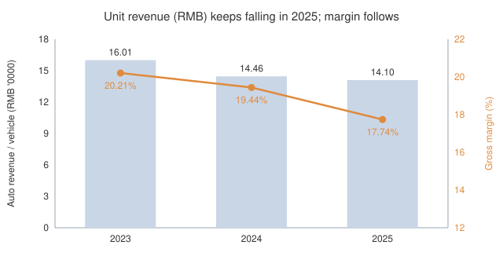
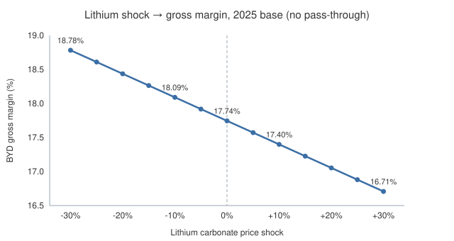
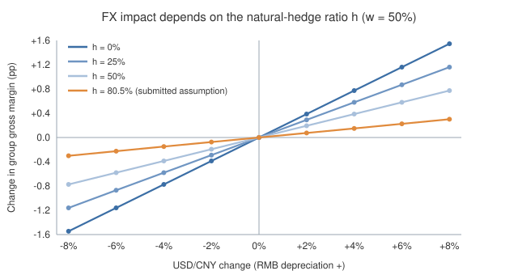

# 比亚迪市场风险分析

[English](README.md) · **中文**

硕士《金融风险管理》课程小组项目的市场风险部分——小组为比亚迪（1211.HK）设计企业风险管理框架，都柏林大学 Smurfit 商学院会计与财务管理硕士（2026）。

本仓库**只包含由我撰写的市场风险章节**。小组报告的其余部分（治理框架、运营风险、国别风险）未收录。

> **修正版说明**：课程提交后，我对照 Wind 源表逐格复核了计算底稿，发现并修正了五处错误（见文末[「相对提交版的修正」](#相对提交版的修正)）。本页与 `data/`、`analysis/` 下的数字均为修正后结果；[`report/market-risk-analysis.pdf`](report/market-risk-analysis.pdf) 保留提交时的原件，未作改动。

## 要回答的问题

比亚迪的规模与海外敞口同时快速扩张，但外部环境更拥挤也更波动。哪些外部变量真正会传导到利润？传导幅度有多大？哪一个更值得盯？

分三条路径考察：**价格竞争**、**原材料价格**、**汇率**。全部数字为人民币口径，基准年 2025。

## 结论

### 一、价格竞争：单车收入连续三年下降，增长靠海外

| | 2023 | 2024 | 2025 |
|---|---|---|---|
| 汽车销量（百万辆） | 3.02 | 4.27 | 4.60 |
| 销量增速 | 62.4% | 41.4% | 7.7% |
| 营业收入增速 | 42.0% | 29.0% | 3.5% |
| 汽车单车收入（万元） | 16.01 | 14.46 | 14.10 |
| 单车收入变动 | −8.3% | −9.7% | −2.5% |
| 毛利率 | 20.21% | 19.44% | 17.74% |
| 境内收入增速 | 32.9% | 25.6% | **−11.2%** |
| 国外收入增速 | 75.2% | 38.5% | 40.1% |

汽车分部收入的量价拆解（十亿元）：

| | 收入变动 | 量效应 | 价效应（含车型结构） |
|---|---|---|---|
| 2024 | +133.9 | +200.1 | −66.2 |
| 2025 | +31.3 | +47.7 | −16.5 |

- 单车收入三年都在降，价格效应持续抵消销量带来的增长，定价权在减弱。
- 2025 年境内收入下降 11.2%，全部增长来自海外（+40.1%）。国内是**量价齐压**，不能只归因于价格竞争。
- 没有分车型数据，"价效应"里含车型结构变化（如低价车型占比上升），无法再细分。



数据：[`data/byd-key-metrics-2023-2025.csv`](data/byd-key-metrics-2023-2025.csv) · [`analysis/auto-revenue-volume-price-bridge.csv`](analysis/auto-revenue-volume-price-bridge.csv)

### 二、锂价：±10% 冲击约影响毛利率 0.35 个百分点

采用三级传导，不假设锂价与销售成本 1:1 联动：

```
锂相关成本 = 营业成本 × 汽车成本占比 × 电池包占整车 × 锂占电池成本
           = 6,613 亿元 × 77.99% × 35% × 15.4% ≈ 278 亿元（占营业成本 4.2%）
营业成本₁ = 营业成本₀ + 锂相关成本 × Δ锂价 × (1 − 转嫁率)
```

| 环节 | 系数 | 出处 |
|---|---|---|
| 碳酸锂 → 电池成本 | 15.4% | 中信证券估计（外部引用） |
| 电池包 → 整车 | 35% | IEA 基准（价值口径，外部引用） |
| 汽车成本 → 营业成本 | 77.99% | 比亚迪 2025 年主营构成 |

| 锂价冲击 | −30% | −10% | 0 | +10% | +30% |
|---|---|---|---|---|---|
| 毛利率 | 18.78% | 18.09% | 17.74% | 17.40% | 16.71% |
| 变动（百分点） | +1.04 | +0.35 | — | −0.35 | −1.04 |

锂价每变动 10%，税前影响约 28 亿元，相当于 2025 年净利润的 8.5%（不考虑转嫁）。

**局限**：用实物量粗估（460 万辆 × 约 40 kWh × 约 0.6 kg LCE/kWh × 2025 年均价）只得到约 82 亿元锂成本，约为系数法的 1/3。15.4% 可能取自锂价更高的年份，因此上表更接近**上限**。




数据：[`analysis/lithium-cost-sensitivity.csv`](analysis/lithium-cost-sensitivity.csv)

### 三、汇率敞口是结构性上升

海外收入占比由 2022 年的 21.6% 升至 2025 年的 38.7%（3,107 亿元）。年报未拆分海外收入的币种，因此以 USD/CNY 作为总体外币敞口的基准。

2020 年以来，USD/CNY 与 EUR/CNY 大体跟随美国、欧元区对中国的十年期国债收益率差变动，可作为汇率预期的参照。


### 四、汇率敏感性：结果取决于自然对冲比例，很可能大于锂价

```
Δ毛利 = 国外收入 × w × ΔUSD/CNY × (1 − h)
```

- *w*：国外收入中美元（及挂钩货币）占比，情景取 50%
- *h*：外币成本占外币收入的比例，即自然对冲程度。h = 0 表示外销车的成本全部是人民币；h = 80.5%（国外成本 / 国外收入）等价于提交版的公式

**对集团毛利率的影响（百分点，w = 50%）**

| ΔUSD/CNY | h = 0% | h = 25% | h = 50% | h = 80.5%（提交版假设） |
|---|---|---|---|---|
| −8% | −1.55 | −1.16 | −0.77 | −0.30 |
| −4% | −0.77 | −0.58 | −0.39 | −0.15 |
| +4% | +0.77 | +0.58 | +0.39 | +0.15 |
| +8% | +1.55 | +1.16 | +0.77 | +0.30 |

h = 0 时，人民币升值 8% 使毛利减少约 124 亿元，相当于净利润的 38%。即使 h = 50%，影响（−0.77 个百分点）也大于锂价 ±10% 的影响（0.35 个百分点）。

**结论**：提交版得出"汇率主要影响海外利润折算、不会造成全公司毛利大幅波动"，是因为公式隐含了 80.5% 的自然对冲。放开这一假设后，**汇率很可能是 2025 年比锂价更大的市场风险**。关键未知量是 h，所以董事会应要求披露或跟踪外币成本占比与套保比例，把它作为首要监控指标。



数据：[`analysis/fx-overseas-gross-profit-sensitivity.csv`](analysis/fx-overseas-gross-profit-sensitivity.csv)

## 相对提交版的修正

| # | 提交版 | 问题 | 修正 |
|---|---|---|---|
| 1 | 汽车成本占营业成本 55.85% | 底稿用 **2023 年**汽车成本除以 2025 年营业成本 | 2025 年正确值 77.99% |
| 2 | 锂价 ±10% → 销售成本 ±10% | 公式把锂成本按系数反推回整个销售成本，结果成了 1:1 传导，与正文方法矛盾 | 营业成本₁ = 营业成本₀ + Δ锂成本 |
| 3 | 基准"毛利率" 52.4% | 用（收入 − 成本）/ 成本算，实为成本加成率 | 改为（收入 − 成本）/ 收入 = 17.74% |
| 4 | 汇率冲击乘在海外毛利上 | 隐含海外成本与收入同币种（h = 80.5%），低估敞口 | 引入 h，按外币收入净敞口计算 |
| 5 | 增速与单车收入按美元口径 | Wind GSD 按各年末汇率折美元，增速混入汇率变动；单车收入单位实为千美元 | 全部还原为人民币口径（与年报一致） |

修正后 2025 年单车收入仍下降 2.5%（美元口径下显示为持平），价格压力的判断反而更有依据。

## 仓库结构

```
report/     提交版报告 PDF（原件）+ 修正版中英文精简文字
data/       关键指标（人民币）、碳酸锂季度价格与毛利率、汇率、海外收入结构
analysis/   量价拆解、锂价敏感性、汇率敏感性（ΔUSD/CNY × 自然对冲比例）
figures/    图表
```

## 数据说明

财务数据取自 Wind（GSD 利润表、主营构成），并以 Wind 折算所用的年末汇率还原为人民币，与年报人民币数一致（如 2024 年营业收入 7,771 亿元）。**付费金融终端的原始导出文件未收录在本仓库中。**

## 方法与工具

Excel 完成数据整理与敏感性建模（所有中间量为公式，可追溯），Python 生成 CSV 与图表。

---

王丹暘 · woshiwdy@163.com
