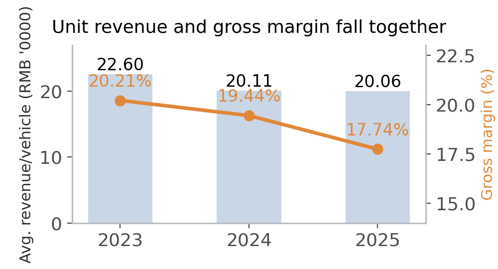
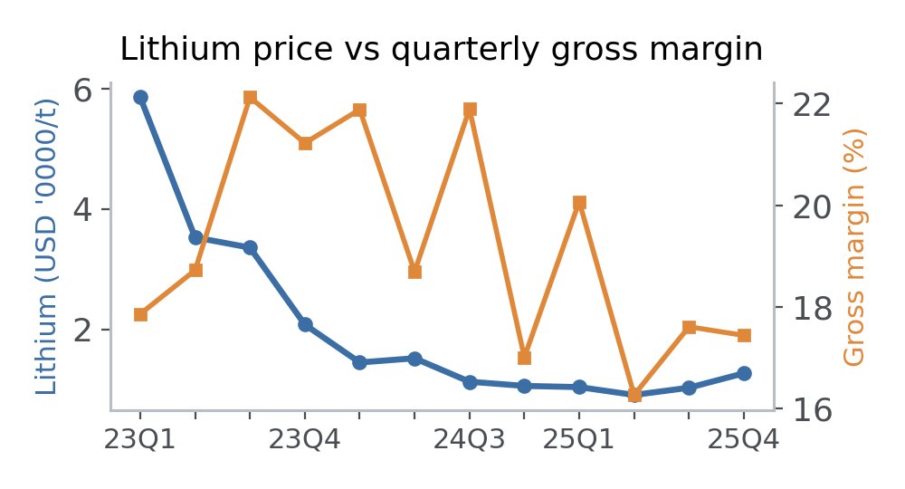
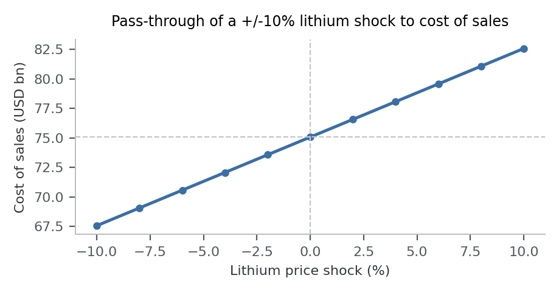
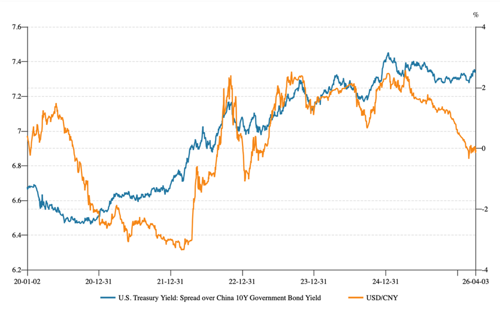
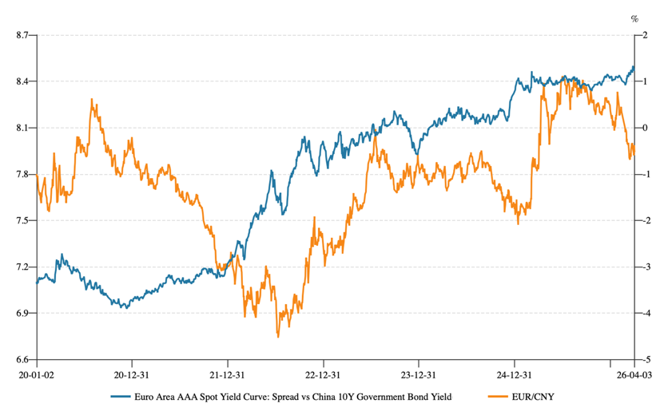

# BYD Market Risk Analysis

**English** · [中文](README-zh.md)

Market risk workstream of a group project on **enterprise risk management for BYD (1211.HK)**, completed for the Financial Risk Management module, MSc Accounting and Financial Management, UCD Smurfit Business School (2026).

This repository contains **only the market risk section, which I authored**. The wider group report (governance framework, operational risk, country risk) is not included.

📄 **[Read the full report (PDF)](https://github.com/siiucd1-cyber/byd-market-risk-analysis/blob/main/report/market-risk-analysis.pdf)** — the submitted coursework document, with the original charts and tables. A condensed write-up is in [`report/market-risk-analysis.md`](report/market-risk-analysis.md).

## Question

BYD is growing quickly in scale and in overseas exposure, but into a more crowded and more volatile environment. Which external channels actually transmit into earnings, and by how much?

Three channels are examined: **price competition**, **raw material prices**, and **foreign exchange**.

## Findings

### 1. Price competition is already visible in the numbers

| | 2023 | 2024 | 2025 |
|---|---|---|---|
| Vehicle sales (m units) | 3.02 | 4.27 | 4.60 |
| Vehicle sales growth | 62.4% | 41.4% | 7.7% |
| Revenue growth | 39.7% | 27.1% | 5.8% |
| Avg. revenue per vehicle (RMB '0000) | 22.60 | 20.11 | 20.06 |
| Gross margin | 20.21% | 19.44% | 17.74% |

Volumes still rise, but growth decelerates sharply while average revenue per vehicle and gross margin fall together — the signature of price-led competition rather than demand weakness.



### 2. Lithium transmits to cost of sales through a three-stage chain

Rather than assuming a 1:1 pass-through from lithium price to cost, the analysis uses a staged mechanism with sourced coefficients:

```
ΔCoS = CoS₀ × 35% × 15.4% × ΔLC
```

| Stage | Coefficient | Source |
|---|---|---|
| Lithium carbonate → battery cost | 15.4% | CITIC Securities estimate |
| Battery pack → vehicle value | 35% | IEA benchmark |
| Vehicle cost → BYD cost of sales | 55.85% | BYD 2025 annual report |

A ±10% lithium price shock is then run through to cost of sales and gross margin ([`analysis/lithium-cost-sensitivity.csv`](analysis/lithium-cost-sensitivity.csv)).





### 3. FX exposure is rising structurally

Overseas revenue share moved from 21.6% (2022) to 38.7% (2025), while domestic revenue growth turned negative (−9.2%) in 2025. Because BYD discloses overseas revenue without a regional breakdown, USD/CNY is used as a proxy for aggregate non-RMB exposure rather than assigning exposure to any single currency.

USD/CNY and EUR/CNY are shown to track the 10-year sovereign yield differential against China over 2020–2025, which is used as the reference for exchange-rate expectations.





### 4. FX sensitivity: overseas gross profit under a two-factor grid

The currency composition of overseas revenue is not disclosed, so exposure is modelled with a deliberately simple two-factor framework — an assumed USD share of overseas revenue (*w*) against a USD/CNY shock:

```
Overseas Gross Profit₁ = Overseas Gross Profit₀ × (1 + w × ΔUSD/CNY)
```

**Sensitivity of overseas gross profit ($bn)** — base case $8.60bn

| ΔUSD/CNY | w = 30% | w = 40% | w = 50% | w = 60% | w = 70% |
|---|---|---|---|---|---|
| **−8%** | 8.40 | 8.33 | 8.26 | 8.19 | 8.12 |
| **−7%** | 8.42 | 8.36 | 8.30 | 8.24 | 8.18 |
| **−6%** | 8.45 | 8.40 | 8.35 | 8.29 | 8.24 |
| **−5%** | 8.47 | 8.43 | 8.39 | 8.35 | 8.30 |
| **−4%** | 8.50 | 8.47 | 8.43 | 8.40 | 8.36 |
| **−3%** | 8.53 | 8.50 | 8.47 | 8.45 | 8.42 |
| **−2%** | 8.55 | 8.53 | 8.52 | 8.50 | 8.48 |
| **−1%** | 8.58 | 8.57 | 8.56 | 8.55 | 8.54 |
| **0%** | 8.60 | 8.60 | 8.60 | 8.60 | 8.60 |
| **+1%** | 8.63 | 8.64 | 8.65 | 8.65 | 8.66 |
| **+2%** | 8.65 | 8.67 | 8.69 | 8.71 | 8.72 |
| **+3%** | 8.68 | 8.71 | 8.73 | 8.76 | 8.78 |
| **+4%** | 8.71 | 8.74 | 8.78 | 8.81 | 8.84 |
| **+5%** | 8.73 | 8.78 | 8.82 | 8.86 | 8.90 |
| **+6%** | 8.76 | 8.81 | 8.86 | 8.91 | 8.96 |
| **+7%** | 8.78 | 8.84 | 8.90 | 8.96 | 9.02 |
| **+8%** | 8.81 | 8.88 | 8.95 | 9.02 | 9.08 |

Overseas profitability rises with USD/CNY, and the size of the effect grows with the assumed USD share: an 8% move shifts overseas gross profit by $0.21bn at *w* = 30% but $0.48bn at *w* = 70%. FX risk therefore reaches BYD mainly through the translation of overseas profit, not through large company-wide margin swings.

Machine-readable grid: [`analysis/fx-overseas-gross-profit-sensitivity.csv`](analysis/fx-overseas-gross-profit-sensitivity.csv)

## Repository contents

```
report/     full report (PDF, as submitted) + condensed write-up in English and Chinese
data/       key metrics, quarterly lithium prices and gross margin, FX rates, overseas revenue mix
analysis/   sensitivity grids: lithium cost (±10%), FX translation (ΔUSD/CNY × USD share)
figures/    charts: price competition, lithium vs gross margin, lithium sensitivity, USD/CNY and EUR/CNY vs yield differentials
```

## Data note

All figures published here are either compiled by me or derived from BYD's publicly filed annual reports and public commodity/FX series. Raw exports from licensed market-data terminals are deliberately **not** included in this repository.

## Method and tools

Excel for data assembly and sensitivity modelling; staged transmission modelling for the cost channel; descriptive and comparative analysis for the FX channel. Coefficients are sourced rather than assumed, and each conclusion is traceable to the underlying series in `data/`.

---

Wang Danyang · woshiwdy@163.com
